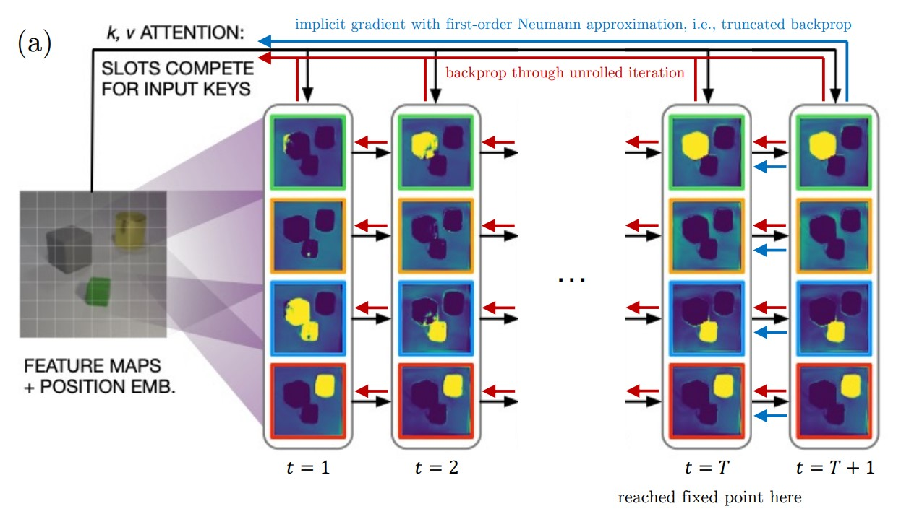

</img>
# Slot-Attention-Iterative-Refinement
Unofficial Implementation of papers [Object Representations as Fixed Points: Training Iterative Refinement Algorithms with Implicit Differentiation](https://arxiv.org/pdf/2207.00787.pdf) and 
[Object-Centric Learning with Slot Attention](https://arxiv.org/abs/2006.15055) by Phan Nhat Huy

## To do:
- [] Implement Slot Attention
- [] Implement Implicit Differentiation for Slot Attention
- [] Running experiments with CLEVR dataset
- [] Running experiments with Reasoning dataset

## Installation
Current version of implementation has tested with pytorch 2.0 but it should work with pytorch > 1.0.0. To install all dependencies, just run.
```
python3 -r requirements.txt
```

## Usage
This implementation is fairly simple to use. With a user specificed configuration file, `main.py` will do anything else. The configuration file consists of 3 parts: 
Model, Training and Testing config. 

Combining all parts we have following general configuration file.
```yaml
Model:
    num_slots: 4
    num_heads: 4
    num_layers: 2
    feat_size: 256
    dropout: 0.1
    implicit_diff: True
    max_iter_fwd: 10
Training:
    data_type: CLEVR
    batch_size: 64
    num_workers: 4
    num_epochs: 100
    lr: 0.0001
    weight_decay: 0.0001
    log_interval: 100
    save_interval: 1000
    save_dir: ./checkpoints
    device: cuda
Testing:
    data_type: CLEVR
    batch_size: 64
    num_workers: 4  
```
To run, just input the config path as argument
```
python3 main.py --cfg configs/baseline.yaml
```
## Citation
```bibtex
@article{Locatello2020ObjectCentricLW,
  title={Object-Centric Learning with Slot Attention},
  author={Francesco Locatello and Dirk Weissenborn and Thomas Unterthiner and Aravindh Mahendran and Georg Heigold and Jakob Uszkoreit and Alexey Dosovitskiy and Thomas Kipf},
  journal={ArXiv},
  year={2020},
  volume={abs/2006.15055}
}
@article{Chang2022ObjectRA,
  title={Object Representations as Fixed Points: Training Iterative Refinement Algorithms with Implicit Differentiation},
  author={Michael Chang and Thomas L. Griffiths and Sergey Levine},
  journal={ArXiv},
  year={2022},
  volume={abs/2207.00787}
}
```
